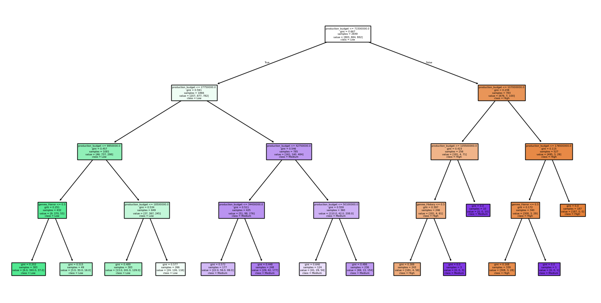
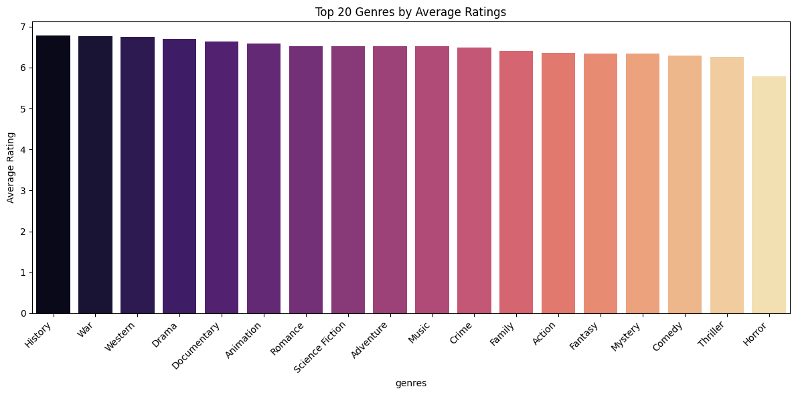
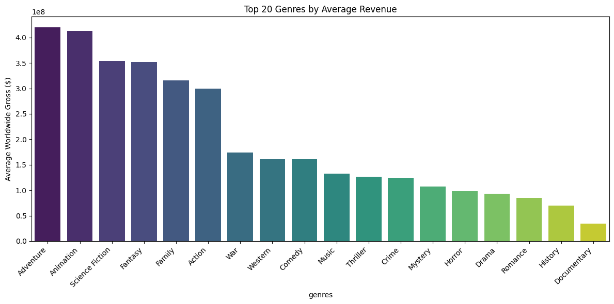
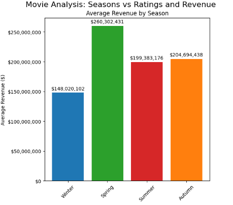
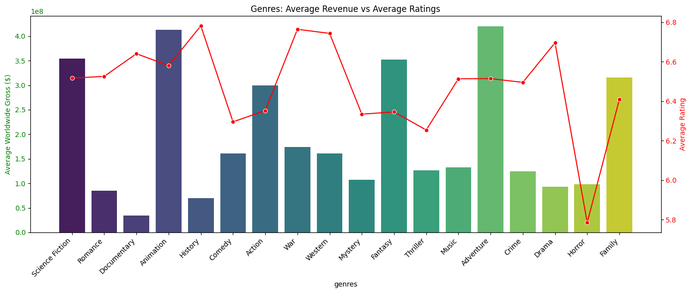

# 🎬 Box Office Intelligence: Data-Driven Insights for a New Movie Studio

### **Executive Team**

#### **Group 6**

|Team Members                                | Email                               |
| --------------------------------------- | ------------------------------------------------------------------------------------ |
| **Jeremy Onsongo** | jeremy.onsongo@student.moringaschool.com                        |
| **Mary Okello**                          | mary.okello@student.moringaschool.com                                                                |
| **Michelle Ngunya**                     | michelle.ngunya@student.moringaschool.com                                      |
| **Michelle Maina**                      | Smichelle.maina1@student.moringaschool.com                                                   |

## Introduction  
Our goal was to identify which film genres and budgets maximize **box office revenue**, ensure **strong audience reception**, and balance **financial ROI**.  
Using historical data, we modeled how **production budgets, genres, ratings, ROI, and release timing** influence performance.  

---

## Business Questions & Insights  

### 1. Which genres deliver the highest revenue?  
- **Revenue Model (OLS Regression):** Budget is the strongest driver (every $1 → ~$3.32 in gross).  
- **Significant uplift:** *Animation* (+$76M vs others at same budget).  
- **Top average revenue genres:** *Adventure, Animation, Sci-Fi*.  

---

### 2. How do production budgets and genre choices interact to impact revenue?  
- **Budget threshold effect:** Films below $71M are far more likely to fall in the *low revenue* category.  
- High-budget films (> $71M) often yield *medium/high revenues*, depending on genre.  

 

---

### 3. Which genres earn the highest audience ratings?  
- **Top rated genres:** *History, War, Drama, Animation*.  
- **Lowest ratings:** *Horror* (−0.57 points on a 10-point scale).  
- Genre explains little of ratings variance (R² ≈ 0.07), meaning *story, cast, and marketing* play large roles.  

---

### 4. Which genres balance ratings *and* revenue?  
- **Animation** stands out as the only genre with both *high ratings* and *high revenue uplift*.  
- Prestige genres (*Drama, History, War*) earn strong ratings but don’t guarantee high revenue.  

---

### 5. Which genres maximize ROI?  
- **Top ROI performers:** *Horror (7.17x), Documentaries (4.56x)* — small budgets, high returns.  
- **Low ROI genres:** *Fantasy (1.39x), Adventure (1.24x), Action (1.19x)* — require massive budgets but underperform unless franchise-driven.  

---

### 6. Does release timing matter?  
- **Ratings by season:** Autumn films score highest (6.64 avg), Spring films second (6.42).  
- **Revenue by season:** Spring has strong average grosses, Summer slightly lower despite high release volumes.  
- **Statistical test (ANOVA):** Season significantly affects ratings (p < 0.001).  

---

### 7. Do better ratings lead to higher revenue?  
- Weak but positive correlation (r ≈ 0.33).  
- Some high-rated films earn modest revenue, and some low-rated films gross high — proving **franchises and marketing** are critical.  

---

## 🎬 Recommendations  

1. **Flagship Strategy:** Focus on *high-budget Animation & Adventure films* for predictable revenue.  
2. **Reputation Strategy:** Select *Drama, History, War projects* to win awards & critical acclaim.  
3. **High ROI Bets:** Invest in *Horror & Documentaries* for smaller-budget, high-return projects.  
4. **Timing Strategy:** Prioritize *Autumn & Spring releases* to maximize ratings and revenue impact.  
5. **Caution:** Horror movies have ROI upside but polarizing ratings. Action/Fantasy need franchises to justify costs.  

---

## 📂 Sources  
- Historical box office data (worldwide gross, domestic/foreign splits)  
- Production budgets  
- Genre classifications  
- IMDb-style audience ratings  
- Seasonal release patterns  

